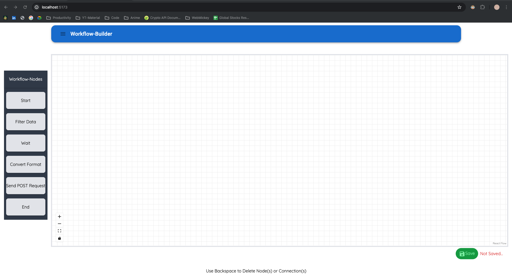
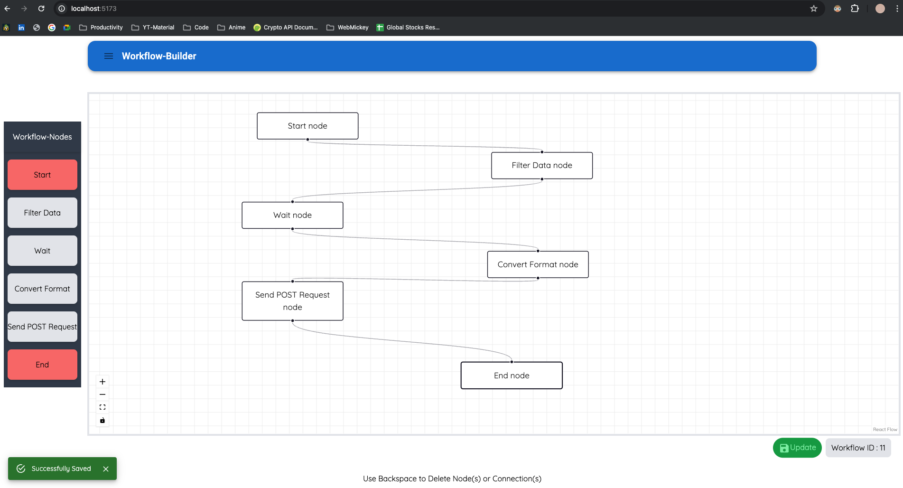
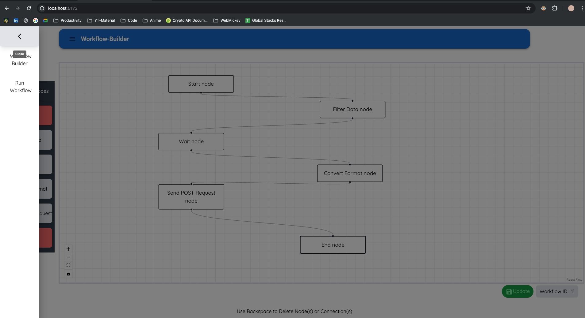
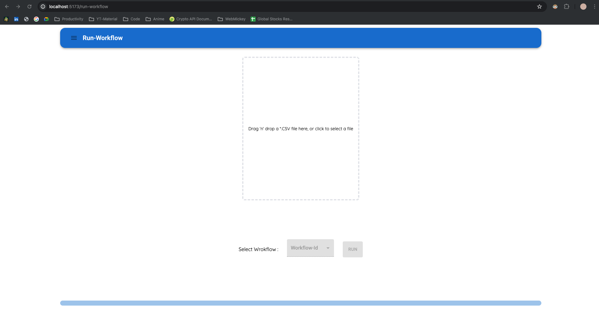
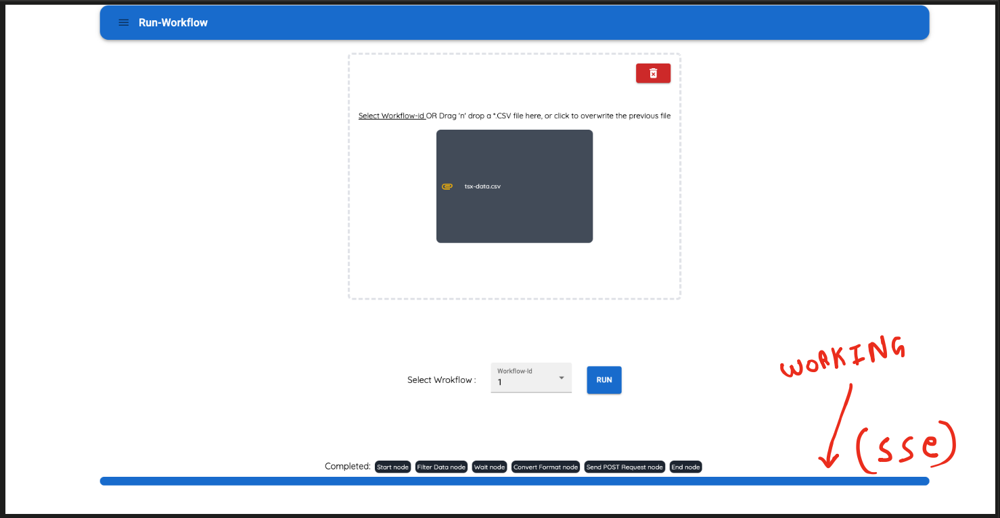
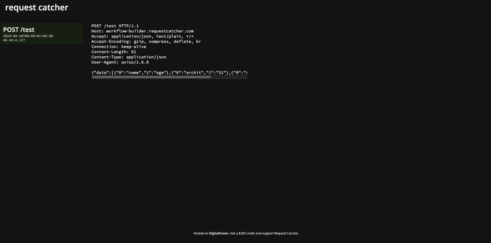

# Workflow Management Application

## Tech Stack

- **Frontend**: ReactJS + TypeScript + Tailwind CSS + ReactFlow + Redux + Material-UI
- **Backend**: NestJS + PostgreSQL + TypeORM + TypeScript + class-transformer + class-validator

## Features

- **React-Flow**: Create workflows with drag-and-drop nodes:
  - 'Start' node
  - 'Filter Data' node: Converts CSV columns to lowercase
  - 'Wait' node: Waits for 5 seconds
  - 'Convert Format' node: Converts CSV file to JSON
  - 'Send POST Request' node
  - 'End' node
- Select and run workflows on the run-workflow page.
- **react-router-dom** for routing.
- **redux** for state management including error, success, and navigation states.
- Progress bar with **Server-Side Events (SSE)/EventSource**.

## Screenshots

1. **Work Flow Home**
   
   Description: Overview of the workflow home page.

2. **Save Workflow to Get Workflow ID**
   
   Description: Saving a workflow to obtain a workflow ID.

3. **Nav-bar**
   
   Description: Navigation bar for easy access to different sections of the application.

4. **Run Workflow with Different Routing**
   
   Description: Running a workflow with different routing options.

5. **Working Progress-Bar**
   
   Description: Progress bar indicating the status of the workflow execution.

6. **POST Request Working**
   
   Description: Illustration of a POST request being processed within the workflow.

## Getting Started

### Prerequisites

- Node.js and npm installed.
- PostgreSQL database set up.

### Installation

1. Rename `./frontend/env.env` to `./frontend/.env` and `./backend/env.env` to `./backend/.env`.
2. Navigate to the `frontend` directory in your terminal and run `npm install`.
3. Navigate back to the root directory and then to the `backend` directory in your terminal and run `npm install`.
4. Set up PostgreSQL according to the configurations specified in `./backend/.env`.

### Running Locally

1. Open two separate terminals:
   - Terminal 1: Navigate to the `frontend` directory and run `npm run start`.
   - Terminal 2: Navigate to the `backend` directory and run `npm run start:dev`.

Your application should now be up and running locally.
